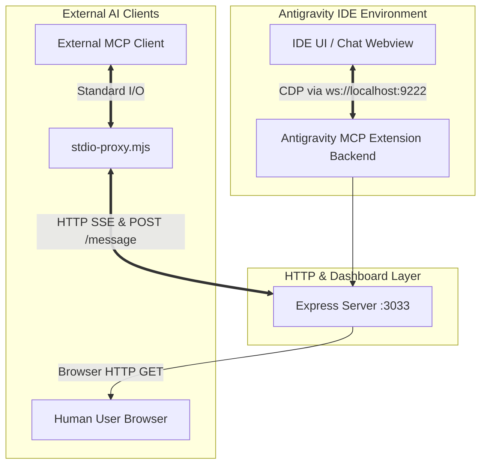

# Architecture & Development Guide

## 🏰 Architecture & Data Flow

Below is a data flow diagram of the system:

**Lifecycle Workflow:**
1. Upon IDE startup (`onStartupFinished`), `extension.ts` launches Express on port 3033.
2. `cdpHelper.ts` periodically polls port 9222 (Antigravity's integrated debugger) and parses DOM changes.
3. Express serves the dashboard and keeps a persistent `/sse` connection open.
4. An external AI agent executes `node bin/stdio-proxy.mjs`.
5. The proxy connects to `/sse`, establishing a bidirectional channel (AI Agent <-> Proxy <-> Express <-> Extension Source Code <-> CDP <-> DOM).

### Core Components

* **Universal Stdio Proxy:** Transparently translates console communication (`stdin/stdout`) from MCP clients to the IDE via the `stdio-proxy.mjs` script. This script acts purely statelessly by fetching `--host` and `--port` routing targets directly from standard MCP config strings via `process.argv`.
* **Integrated Express Server & Dashboard:** Hosts an HTTP server for visual debug telemetry and monitoring at `http://localhost:3033`. Provides `/sse` endpoint for MCP clients.
* **CDP Scraper (DOM Extraction):** Connects to the editor's internal Chrome DevTools Protocol (CDP) via WebSockets (`ws`). It executes JavaScript (`Runtime.evaluate`) inside target `iframe` / `webview` panels to smoothly pull chat history in real-time. Built-in freeze protection included.

## 📂 Project Structure

For AI developers and agents modifying this project, here is how the codebase is organized:

- `src/extension.ts` — **Entry point.** Registers extension commands (Start/Stop), dynamically configures the MCP proxy arguments, and leverages Dependency Injection to pass variables down to `appBuilder.ts`.
- `src/appBuilder.ts` — **Core Server Logic.** Fully modularized Express routing ecosystem. Contains endpoints like `/history`, `/sse`, and `/new-chat`, decoupling IDE interaction logic from initialization for reliable `supertest` execution.
- `src/cdpHelper.ts` — **Parsing Engine.** Handles low-level WebSocket calls to port 9222. Contains logic for traversing the resource tree and executing scripts within `webview` panels.
- `bin/stdio-proxy.mjs` — **Client Bridge.** A stateless Node.js script routing `stdin` into `POST /message` requests and echoing `SSE` to `stdout`.
- `deploy.js` — **Deployment Script.** Compiles TypeScript into `dist/` and copies the build into Antigravity's extensions folder.
- `INSTALL.md` — Setup instructions tailored for both humans and AI agents.

## 🧠 Important Details & Gotchas (AI Developer Note)

If you are modifying this codebase, pay close attention to the following aspects:

1. **CDP Timeout Handling:** Calls to port 9222 are highly unstable under heavy IDE load. You must use timeouts (`Promise.race`) for all CDP commands. Leaking `WebSocket` connections will inevitably cause OOM crashes in the IDE's Extension Host process.
2. **Config vs Hardcode:** By default, ports `3033` (Express) and `9222` (CDP) are used, but they can be overridden in `settings.json`. The logic MUST use `vscode.workspace.getConfiguration('antigravity-mcp')` as the source of truth. The IDE then persists this state by passing configurations to the standard `mcp_config.json` mapping as `--host` and `--port` string literals so remote clients can boot the proxy without needing shared local file access.
3. **Webview Updates:** HTML classes and DOM structures may change across Antigravity versions. The `eval` logic in `cdpHelper.ts` must be fault-tolerant (e.g., returning `null` rather than crashing).
4. **SSE vs WebSockets Backend:** The MCP `SSEServerTransport` requires *two* endpoints: GET `/sse` (subscription) and POST `/message?sessionId=...` (routing). Do not break this underlying dual-route relationship.
5. **Security:** The Express server must strictly remain locked to `localhost`/`127.0.0.1` (`app.listen(port, '127.0.0.1')`); otherwise, there is a risk of remote arbitrary code execution.
6. **Integration Testing:** The project enforces `vitest` and `supertest` for modular routing verifications. Ensure everything passes cleanly via `npm test` before considering any major refactoring complete.
