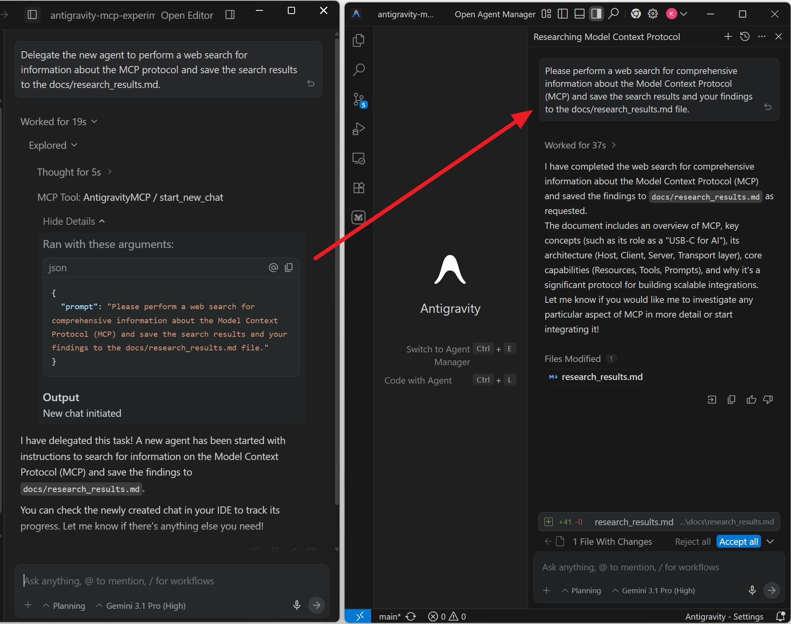
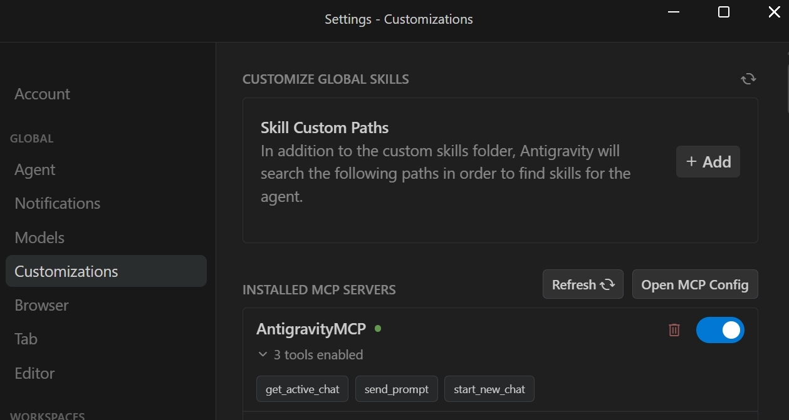
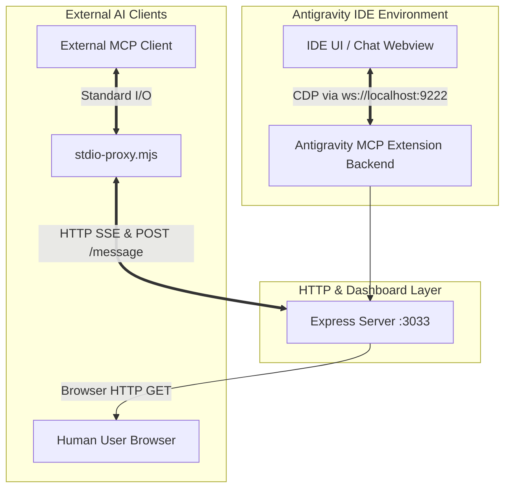

# Antigravity MCP Server (Experimental)

[](https://opensource.org/licenses/MIT)
[](https://github.com/alama777/antigravity-mcp-experimental)
[](https://open-vsx.org/extension/alama777/antigravity-mcp-experimental)
[](https://open-vsx.org/extension/alama777/antigravity-mcp-experimental)

> An experimental extension that introduces a touch of multi-agent capabilities to the Google Antigravity IDE by adding an MCP tool to spawn new agents (launch new chats).

> 📚 **Note:** For the most up-to-date instructions and documentation, always refer to the [GitHub Repository](https://github.com/alama777/antigravity-mcp-experimental).


> [!WARNING]
> **Experimental Disclaimer:** This extension relies heavily on undocumented, internal features of the Antigravity IDE (like internal Webviews and CDP connections). Therefore, **it may stop working at any time following an Antigravity update.** It is highly experimental and **is NOT recommended for use in critical or production projects.**

---

### 📸 Overview


*Example of autonomous agent delegation*


*Extension settings in Antigravity IDE*

## 🌟 Features

This extension connects the Antigravity IDE to the Model Context Protocol (MCP). It allows AI agents and external tools to programmatically read and write to your chat sessions. This makes it easy to automate workflows, delegate tasks, and spawn background agents.

### 🤖 Available MCP Tools

To enable these capabilities, the extension provides the following tools:

| Tool Name | Description | Parameters |
| :--- | :--- | :--- |
| 💬 **`start_new_chat`** | Start a new chat with an optional starting prompt. Use this to delegate a task to a "new agent". <br>*(Note: This tool only queues the message and does NOT wait for the agent to finish replying).* | `prompt` (string, optional) |
| 📨 **`send_prompt`** | Send a new prompt to the active (main/primary) chat. Returns a confirmation string. <br>*(Note: This tool only queues the message and does NOT wait for the agent to finish replying).* | `prompt` (string, required) |
| 🔍 **`get_active_chat`** | Get ID, title, and message count of the active (main/primary) chat. Returns a JSON object with `id`, `title`, and `messageCount`. | *None* |

> [!IMPORTANT]
> **Execution Scope & Limitations:** These MCP tools interact **exclusively with the primary chat** located in the sidebar of the main Google Antigravity editor window. You can trigger these commands from anywhere (from a sub-agent's chat in Agent Manager, from Claude Desktop, etc.), but the actions will *always* apply to the main IDE chat interface.
> 
> **Out of Scope (What MCP CANNOT do):**
> - It cannot read or interact with chats that are opened in separate windows via the Agent Manager.
> - It cannot programmatically select or switch backwards/forwards between existing historical chats.

> [!TIP]
> **Background Execution:** When you trigger `start_new_chat`, the primary IDE view switches to the new session, but **your previous chat is NOT interrupted**. It will continue working and generating its response in the background! You can always return to it via the chat history dropdown, or open it using the Antigravity Agent Manager.

> ⚙️ **Technical Requirement:** Writing to the chat using `start_new_chat` or `send_prompt` relies on internal IDE APIs and **does not require** the debug port. However, reading the chat status using `get_active_chat` relies on the CDP Scraper, meaning the IDE **must** be launched with the `--remote-debugging-port=9222` flag for this specific tool to function.

> **💡 Note:** Ensure you have the Antigravity IDE configured correctly for this extension to interact with its interface.


#### 💡 Real-World Use Cases (Patterns):

1. **Task Delegation (Agent-to-Agent):** 
   You ask your active Antigravity agent to implement a massive feature. The agent realizes the task is too complex for one context window, so it uses `start_new_chat` with the prompt *"Write the backend tests for..."* to autonomously spin up a new specialized sub-agent!

2. **The "Librarian" Pattern (Offloading Research):** 
   You are deep into a complex refactoring task, and your context window is full of source code. You suddenly need to know how a specific external API works. To avoid polluting your active context, your agent uses `start_new_chat` with the prompt: *"Search the web for Stripe API docs, figure out the routing, and save a summary to `stripe_tips.md`"*. The new agent acts as a librarian in the background!

3. **Autonomous Agent Chains:** 
   You can instruct your active agent to create complex pipelines. For example: *"Delegate a backend review to a new agent. Tell it to save the review results to `review.md`, and then instruct it to spawn ANOTHER new agent acting as a developer to immediately process those results."* This allows you to build self-orchestrating teams of agents!

4. **Context Management & Migration:** 
   An agent uses `get_active_chat` to verify its current session depth (message count). If the context is getting too long, you can instruct it: *"Summarize our current chat, and start a new chat with that summary"*. The agent generates the summary and executes `start_new_chat` to seamlessly migrate your workflow to a fresh session, avoiding token limits.

5. **External Integration (Scripting):** 
   You can still command the IDE from the outside! For example, a simple external monitoring bash script detects a server crash and uses `send_prompt` via the proxy to push the error log directly into your active Antigravity chat.

6. **Continuous TDD Loop:** 
   An external watcher script monitors your file system. Every time you save a file, it runs your test suite. If a test fails, the script automatically uses `send_prompt` to push the failing logs directly into your active chat: *"Your last save broke the tests. Here is the output: [...]. Please fix the code."* Your agent fixes it, driving a fully automated Test-Driven Development loop.

7. **CI/CD Integration (Live Alerts):** 
   While you are working locally, a GitHub Actions pipeline fails in the cloud. The CI/CD server pings your local proxy, using `send_prompt` to inject a message into your IDE: *"Pipeline #402 just failed on the Docker Build step. Here are the logs: [link]"*. Your active chat becomes a live notification center.

8. **The "Silent Critic" (Background Code Review):**
   An external demon checks your `get_active_chat` status periodically. If it notices you haven't typed anything in 5 minutes, it uses `start_new_chat` to spawn a background agent: *"Perform a complete code-review of all files changed today and leave TODO comments in the code."* It does this silently, without interrupting your main chat window.

9. **The "Terminal to IDE" Pipeline:** 
   Your local build script fails with a huge, cryptic stack trace. Instead of manually copying and pasting the logs into the IDE, you configure a shell alias (e.g., `fix-it`). Now, running `make build || fix-it` automatically catches the failing output and pipes it into `stdio-proxy.mjs`. The error is sent via `send_prompt` directly to your active chat, ready for the agent to fix!

10. **The "Merge Conflict Negotiator":** 
    You pull `main` and hit a terrifying merge conflict in a 2000-line file. Instead of resolving it in your primary chat (which is polluted with your current feature's business logic), you use `start_new_chat`: *"I have a huge git conflict in `api.ts`. Read the markers and safely combine the logic."* This isolates the complex, high-context task into a fresh session, preserving your main chat's mental model.


## 📥 Installation

For complete step-by-step setup and installation instructions, please carefully refer to the [**INSTALL.md**](INSTALL.md) guide before proceeding.

## 🚀 Usage

To start using this extension:

1. **Launch the Editor (Recommended):** If you want to use the `get_active_chat` tool (e.g. to let agents read chat history context), launch the Antigravity editor with the remote debugging flag enabled:
   ```bash
   antigravity --remote-debugging-port=9222
   ```
   *(Note: You can skip this flag if you only intend to use `start_new_chat` or `send_prompt`).*
2. Press `Ctrl+Shift+P` (or `Cmd+Shift+P` on Mac) inside Antigravity and enter `Antigravity MCP: Start Server` if it isn't set to start automatically.
3. After starting the server, **AntigravityMCP** will become available in the MCP servers settings section inside Antigravity itself, allowing internal agents to use its tools.
4. **Accessing from outside Antigravity:** To connect an external AI client to the IDE, you must configure it to execute the proxy script (`node bin/stdio-proxy.mjs`). Please refer to **[INSTALL.md](INSTALL.md)** for detailed integration examples (e.g., Claude Desktop).

## ⚙️ Requirements

* Antigravity IDE installed locally.
* Node.js (for running the `bin/stdio-proxy.mjs` script).

## 🛠 Extension Settings

You can customize the extension behavior by tweaking the following settings in your `settings.json`:

| Setting | Description | Default Value |
| --- | --- | --- |
| `antigravity-mcp.host` | Host on which the HTTP MCP & dashboard server binds | `localhost` |
| `antigravity-mcp.port` | Port on which the HTTP MCP & dashboard server runs | `3033` |
| `antigravity-mcp.cdpHost` | Host for the Antigravity CDP (Chrome DevTools Protocol) | `localhost` |
| `antigravity-mcp.cdpPort` | Port for the CDP connection (the debugging port exposed by the Antigravity IDE)| `9222` |

> [!NOTE]
> **Restart Required:** To ensure that your new settings are applied reliably, and **after installing a new release** of the extension, please **restart the Antigravity IDE**.

> [!TIP]
> **Troubleshooting Settings:** If the `AntigravityMCP` server shows errors in the IDE's MCP settings panel (which can happen after modifying settings or updating the extension), try toggling it **OFF and then ON again**. This forces the IDE to cleanly re-read the updated configuration. Additionally, you can always monitor detailed system messages and diagnostic logs from the extension by checking the IDE's **Output** panel (specifically, the **"Antigravity MCP"** channel).

## 🏰 Architecture & Data Flow

Below is a data flow diagram of the system:



**Lifecycle Workflow:**
1. Upon IDE startup (`onStartupFinished`), `extension.ts` launches Express on port 3033.
2. `cdpHelper.ts` periodically polls port 9222 (Antigravity's integrated debugger) and parses DOM changes.
3. Express serves the dashboard and keeps a persistent `/sse` connection open.
4. An external AI agent executes `node bin/stdio-proxy.mjs`.
5. The proxy connects to `/sse`, establishing a bidirectional channel (AI Agent <-> Proxy <-> Express <-> Extension Source Code <-> CDP <-> DOM).

### Core Components

* **Universal Stdio Proxy:** Transparently translates console communication (`stdin/stdout`) from MCP clients to the IDE via the `stdio-proxy.mjs` script.
* **Integrated Express Server & Dashboard:** Hosts an HTTP server for visual debug telemetry and monitoring at `http://localhost:3033`. Provides `/sse` endpoint for MCP clients.
* **CDP Scraper (DOM Extraction):** Connects to the editor's internal Chrome DevTools Protocol (CDP) via WebSockets (`ws`). It executes JavaScript (`Runtime.evaluate`) inside target `iframe` / `webview` panels to smoothly pull chat history in real-time. Built-in freeze protection included.

## 📂 Project Structure

For AI developers and agents modifying this project, here is how the codebase is organized:

- `src/extension.ts` — **Entry point.** Registers extension commands (Start/Stop), initializes Express.js, sets up `SSEServerTransport` logic, and declares MCP Tools and Resources.
- `src/cdpHelper.ts` — **Parsing Engine.** Handles low-level WebSocket calls to port 9222. Contains logic for traversing the resource tree and executing scripts within `webview` panels.
- `bin/stdio-proxy.mjs` — **Client Bridge.** A standalone Node.js script routing `stdin` into `POST /message` requests and echoing `SSE` to `stdout`.
- `deploy.js` — **Deployment Script.** Compiles TypeScript into `dist/` and copies the build into Antigravity's extensions folder.
- `INSTALL.md` — Setup instructions tailored for both humans and AI agents.

## 🧠 Important Details & Gotchas (AI Developer Note)

If you are modifying this codebase, pay close attention to the following aspects:

1. **CDP Timeout Handling:** Calls to port 9222 are highly unstable under heavy IDE load. You must use timeouts (`Promise.race`) for all CDP commands. Leaking `WebSocket` connections will inevitably cause OOM crashes in the IDE's Extension Host process.
2. **Config vs Hardcode:** By default, ports `3033` (Express) and `9222` (CDP) are used, but they can be overridden in `settings.json`. The logic MUST use `vscode.workspace.getConfiguration('antigravity-mcp')` as the source of truth.
3. **Webview Updates:** HTML classes and DOM structures may change across Antigravity versions. The `eval` logic in `cdpHelper.ts` must be fault-tolerant (e.g., returning `null` rather than crashing).
4. **SSE vs WebSockets Backend:** The MCP `SSEServerTransport` requires *two* endpoints: GET `/sse` (subscription) and POST `/message?sessionId=...` (routing). Do not break this underlying dual-route relationship.
5. **Security:** The Express server must strictly remain locked to `localhost`/`127.0.0.1` (`app.listen(port, '127.0.0.1')`); otherwise, there is a risk of remote arbitrary code execution.

## ⚠️ Known Issues

- **Port 9222 Required for Reading:** Port 9222 is required for reading chat history. While you can send commands (`start_new_chat`, `send_prompt`) without it, full functionality (such as `get_active_chat`) requires starting Antigravity with the `--remote-debugging-port=9222` flag.

## 📝 Release Notes

For detailed release history, see the [CHANGELOG.md](CHANGELOG.md).

---

## 🤝 Contributing

We welcome pull requests! If you're interested in helping development:

1. Fork the repo at [https://github.com/alama777/antigravity-mcp-experimental](https://github.com/alama777/antigravity-mcp-experimental)
2. Create your feature branch (`git checkout -b feature/AmazingFeature`)
3. Commit your changes (`git commit -m 'Add some AmazingFeature'`)
4. Push to the branch (`git push origin feature/AmazingFeature`)
5. Open a Pull Request!

If you find a bug, please create an [Issue](https://github.com/alama777/antigravity-mcp-experimental/issues).

## 📄 License

This project is licensed under the MIT License - see the [LICENSE](LICENSE) file for details.
