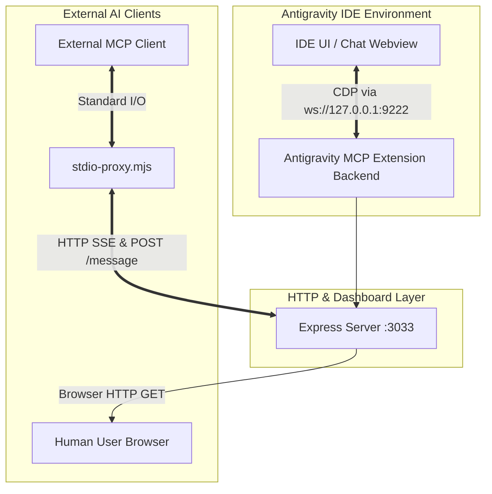

# Antigravity MCP Server (Experimental)

[](https://opensource.org/licenses/MIT)

> An experimental extension that bridges the Antigravity environment's internal chat interface with external AI agents via the Model Context Protocol (MCP).

**AI Agent Note:** This is the primary context document for the project. If you are an AI agent reading this, use this file as the main entry point to understand the codebase, architecture, and project constraints before making changes.

> [!WARNING]
> **Experimental Disclaimer:** This extension relies heavily on undocumented, internal features of the Antigravity IDE (like internal Webviews and CDP connections). Therefore, **it may stop working at any time following an Antigravity update.** It is highly experimental and **is NOT recommended for use in critical or production projects.**

---

## 🌟 Features

This extension provides programmatic control over chats and AI agents directly within the Antigravity IDE without using heavy browser wrappers.

* **CDP Scraper (DOM Extraction):** Connects to the editor's internal Chrome DevTools Protocol (CDP) via WebSockets (`ws`). It executes JavaScript (`Runtime.evaluate`) inside target `iframe` / `webview` panels to smoothly pull chat history in real-time. Built-in freeze protection included.
* **Integrated Express Server & Dashboard:** Hosts an HTTP server for visual telemetry and monitoring at `http://localhost:3033`. Provides `/sse` and `/message` endpoints for clients.
* **Full MCP Ecosystem Compatibility:** 
  * **Resources:** Exposes chat data through MCP Resources (`antigravity://chat/active`).
  * **Tools:**
    * `get_active_chat`: Get ID, title, and message count of the active chat.
    * `send_prompt`: Send a new prompt to the active chat/agent. *Note: this tool only queues the message and does NOT wait for the agent to finish replying.* Parameters: `prompt` (string).
    * `start_new_chat`: Start a new chat session. *Note: this tool only queues the message and does NOT wait for the agent to finish replying.* Parameters: `prompt` (string, optional).
* **Universal Stdio Proxy:** Transparently translates console communication (`stdin/stdout`) from MCP clients to the IDE via the `stdio-proxy.mjs` script.

> **💡 Note:** Ensure you have the Antigravity IDE configured correctly for this extension to interact with its interface.

## 🚀 Usage

To start using this extension:

1. **Critical Step:** Launch the Antigravity editor with the remote debugging flag enabled:
   ```bash
   antigravity --remote-debugging-port=9222
   ```
2. Press `Ctrl+Shift+P` (or `Cmd+Shift+P` on Mac) inside Antigravity and enter `Start Antigravity MCP Server` if it isn't set to start automatically.
3. After starting the server, **AntigravityMCP** will become available in the MCP servers settings section inside Antigravity itself, allowing internal agents to use its tools.
4. **Accessing from outside Antigravity:** To connect an external AI client (like Claude Desktop) to the IDE, use the provided proxy script:
   ```bash
   node /path/to/antigravity-mcp-experimental/stdio-proxy.mjs
   ```

## ⚙️ Requirements

* Antigravity IDE installed locally.
* Node.js (for running the `stdio-proxy.mjs` script if you use an external client via Stdio).

## 🛠 Extension Settings

You can customize the extension behavior by tweaking the following settings in your `settings.json`:

| Setting | Description | Default Value |
| --- | --- | --- |
| `antigravity-mcp.expressPort` | The port for the internal HTTP express server & dashboard | `3033` |
| `antigravity-mcp.cdpPort` | The debugging port exposed by the Antigravity IDE | `9222` |
| `antigravity-mcp.expressHost` | The host for the HTTP server | `"127.0.0.1"` |
| `antigravity-mcp.cdpHost` | The host for the CDP connection | `"127.0.0.1"` |

## 🏰 Architecture & Data Flow

Below is a data flow diagram of the system:



**Lifecycle Workflow:**
1. Upon IDE startup (`onStartupFinished`), `extension.ts` launches Express on port 3033.
2. `cdpHelper.ts` periodically polls port 9222 (Antigravity's integrated debugger) and parses DOM changes.
3. Express serves the dashboard and keeps a persistent `/sse` connection open.
4. An external AI agent executes `node stdio-proxy.mjs`.
5. The proxy connects to `/sse`, establishing a bidirectional channel (AI Agent <-> Proxy <-> Express <-> Extension Source Code <-> CDP <-> DOM).

## 📂 Project Structure

For AI developers and agents modifying this project, here is how the codebase is organized:

- `src/extension.ts` — **Entry point.** Registers extension commands (Start/Stop), initializes Express.js, sets up `SSEServerTransport` logic, and declares MCP Tools and Resources.
- `src/cdpHelper.ts` — **Parsing Engine.** Handles low-level WebSocket calls to port 9222. Contains logic for traversing the resource tree and executing scripts within `webview` panels.
- `stdio-proxy.mjs` — **Client Bridge.** A standalone Node.js script routing `stdin` into `POST /message` requests and echoing `SSE` to `stdout`.
- `deploy.js` — **Deployment Script.** Compiles TypeScript into `dist/` and copies the build into Antigravity's extensions folder.
- `INSTALL.md` — Setup instructions tailored for both humans and AI agents.

## 🧠 Important Details & Gotchas (AI Developer Note)

If you are modifying this codebase, pay close attention to the following aspects:

1. **CDP Timeout Handling:** Calls to port 9222 are highly unstable under heavy IDE load. You must use timeouts (`Promise.race`) for all CDP commands. Leaking `WebSocket` connections will inevitably cause OOM crashes in the IDE's Extension Host process.
2. **Config vs Hardcode:** By default, ports `3033` (Express) and `9222` (CDP) are used, but they can be overridden in `settings.json`. The logic MUST use `vscode.workspace.getConfiguration('antigravity-mcp')` as the source of truth.
3. **Webview Updates:** HTML classes and DOM structures may change across Antigravity versions. The `eval` logic in `cdpHelper.ts` must be fault-tolerant (e.g., returning `null` rather than crashing).
4. **SSE vs WebSockets Backend:** The MCP `SSEServerTransport` requires *two* endpoints: GET `/sse` (subscription) and POST `/message?sessionId=...` (routing). Do not break this underlying dual-route relationship.
5. **Security:** The Express server must strictly remain locked to `localhost`/`127.0.0.1` (`app.listen(port, '127.0.0.1')`); otherwise, there is a risk of remote arbitrary code execution.

## ⚠️ Known Issues

- **Port 9222 Required:** The extension will not function if Antigravity is not run with the `--remote-debugging-port=9222` flag.

## 📝 Release Notes

For detailed release history, see the [CHANGELOG.md](CHANGELOG.md).

---

## 🤝 Contributing

We welcome pull requests! If you're interested in helping development:

1. Fork the repo at [https://github.com/alama777/antigravity-mcp-experimental](https://github.com/alama777/antigravity-mcp-experimental)
2. Create your feature branch (`git checkout -b feature/AmazingFeature`)
3. Commit your changes (`git commit -m 'Add some AmazingFeature'`)
4. Push to the branch (`git push origin feature/AmazingFeature`)
5. Open a Pull Request!

If you find a bug, please create an [Issue](https://github.com/alama777/antigravity-mcp-experimental/issues).

## 📄 License

This project is licensed under the MIT License - see the [LICENSE](LICENSE) file for details.
