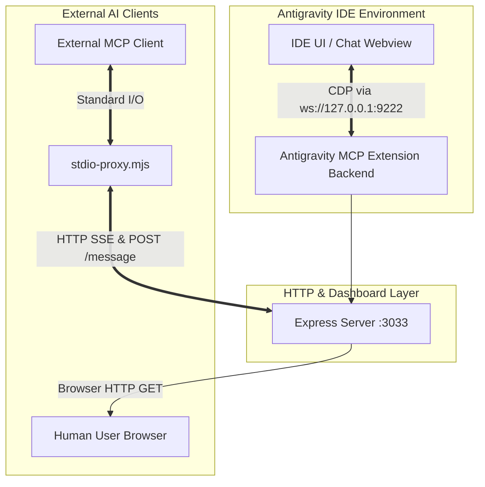

# Antigravity MCP Server (Experimental)

**Antigravity MCP Server** is an experimental extension for the Antigravity environment (based on the VS Code architecture), designed to create a bidirectional bridge between the IDE's internal interface (specifically chat panels) and any external AI agents using the **Model Context Protocol (MCP)** standard.

This is the primary context document for the project. If you are an AI agent reading this, use this file as the main entry point to understand the codebase, architecture, and project constraints before making changes.

---

## 🎯 Purpose & Goals

Antigravity utilizes internal UI elements (Webviews) that are highly restricted and difficult to access "from the outside" or even through the standard VS Code API.

**Main goal:** Programmatic management of chats and AI agents directly within the Antigravity environment. The extension enables external systems to create new sessions, send prompts, and coordinate agent actions via a standardized protocol (MCP).

Architectural highlights:
- Avoids heavy browser wrappers (Puppeteer/Playwright), minimizing the risk of memory leaks in the Extension Host.
- Stricly separates transports (CDP for reading, SSE for broadcasting, Stdio for MCP).
- Provides a graphical dashboard for visual debugging and monitoring.

---

## ⚡ Key Features

1. **CDP Scraper (DOM Extraction)**
   - Connects to the editor's internal Chrome DevTools Protocol (CDP) via WebSockets (`ws`).
   - Executes JavaScript (`Runtime.evaluate`) inside target `iframe` / `webview` panels to "pull" chat history.
   - Built-in freeze protection: strict timeouts and automatic `ws` connection closure.

2. **Integrated Express Server & Dashboard**
   - The extension spins up an HTTP server alongside the IDE (port `3033` by default).
   - Serves visual telemetry (Dashboard): users can open `http://localhost:3033` to view the real-time status of DOM extraction.
   - Provides `/sse` and `/message` endpoints for MCP clients.

3. **Full MCP Ecosystem Compatibility**
   - The tool acts as an official MCP Server using the `@modelcontextprotocol/sdk` package.
   - **Resources**: Exposes raw data (history) as URIs (e.g. `antigravity://chat/active`).
   - **Tools/Commands**: Allows an MCP client to trigger actions inside the IDE. The server supports the following tools:
     - `get_active_chat`: Get ID, title, and message count of the active chat in Antigravity. (Also referred to as active, main, primary chat or active agent). Returns a JSON object with id, title, and messageCount.
     - `send_prompt`: Send a new prompt to the active chat/agent. Returns a confirmation string. Note: this tool only queues the message and does NOT wait for the agent to finish replying.
       - **Parameters**: `prompt` (string) - The text instruction or message to send.
     - `start_new_chat`: Start a new chat with an optional starting prompt. Use this when delegating a task to a "new agent". Returns a confirmation string. Note: this tool only queues the message and does NOT wait for the agent to finish replying.
       - **Parameters**: `prompt` (string, optional) - The initial task or message to start the new chat/agent with.

4. **Universal Stdio Proxy**
   - Since most external MCP clients expect the server to run in the console and communicate via `stdin/stdout`, the project includes the `stdio-proxy.mjs` script. This proxy transparently translates console commands into HTTP SSE requests directed to the extension running in the IDE.

---

## 🏰 Architecture

Below is a data flow diagram of the system:

**Lifecycle Workflow:**
1. Upon IDE startup (`onStartupFinished`), `extension.ts` launches Express on port 3033.
2. `cdpHelper.ts` periodically polls port 9222 (Antigravity's integrated debugger) and parses DOM changes.
3. Express serves the dashboard and keeps a persistent `/sse` connection open.
4. An external AI agent executes `node stdio-proxy.mjs`.
5. The proxy connects to `/sse`, establishing a bidirectional channel (AI Agent <-> Proxy <-> Express <-> Extension Source Code <-> CDP <-> DOM).

---

## 📂 Project Structure

For AI agents applying modifications, here is how the codebase is organized:

- `src/extension.ts` — **Entry point.** Registers extension commands (Start/Stop), initializes Express.js, sets up `SSEServerTransport` logic, and declares MCP Tools and Resources.
- `src/cdpHelper.ts` — **Parsing Engine.** Handles low-level WebSocket calls to port 9222. Contains logic for traversing the resource tree (`Page.getResourceTree`), finding target frames (e.g., `workbench.html`), and executing scripts within them.
- `stdio-proxy.mjs` — **Client Bridge.** A standalone Node.js script. It does NOT run inside the IDE. It runs as part of the MCP client process, translating `stdin` into `POST /message` requests for the 3033 web server, and echoing incoming `SSE` events to `stdout`.
- `deploy.js` — **Deployment Script.** Compiles TypeScript (`dist/`) and copies the build into Antigravity's system extensions folder (overwriting legacy versions).
- `INSTALL.md` — Setup instructions tailored for both humans and AI agents.

---

## 🛠 Important Details & Gotchas (AI Developer Note)

If you (an AI agent) are modifying this project, pay close attention to the following aspects:

1. **Startup Flag (Critical):** The Antigravity editor **MUST** be launched with the `--remote-debugging-port=9222` flag. Without this flag, the extension will not be able to connect to the internal interface, and all requests will fail.
2. **CDP Timeout Handling:** Calls to port 9222 are highly unstable under heavy IDE load. You must use timeouts (`Promise.race`) for all CDP commands. Leaking `WebSocket` connections will inevitably cause OOM crashes in the IDE's Extension Host process.
3. **Config vs Hardcode:** By default, ports `3033` (Express) and `9222` (CDP) are used. However, they can be overridden by the user in the editor's `settings.json` (section `antigravity-mcp.*`). The logic in `extension.ts` MUST use `vscode.workspace.getConfiguration('antigravity-mcp')` as the source of truth.
4. **Webview Updates:** HTML classes and DOM structures in chat sessions may change across Antigravity versions. The `eval` logic in `cdpHelper.ts` must be as fault-tolerant as possible (e.g., surviving missing selectors and falling back to returning `null` rather than crashing).
5. **SSE vs WebSockets Backend:** Be aware that the MCP `SSEServerTransport` from `@modelcontextprotocol/sdk` requires *two* endpoints: one for subscription (GET `/sse`) and a second for routing messages (POST `/message?sessionId=...`). The `stdio-proxy.mjs` correctly handles this pairing. Do not break this underlying dual-route relationship if you refactor routing.
6. **Security:** Currently, the Express server runs without authentication on the `localhost` interface. Ensure the Express binding strictly remains locked to `localhost`/`127.0.0.1` (`app.listen(port, '127.0.0.1')`); otherwise, there is a risk of remote arbitrary code execution.
